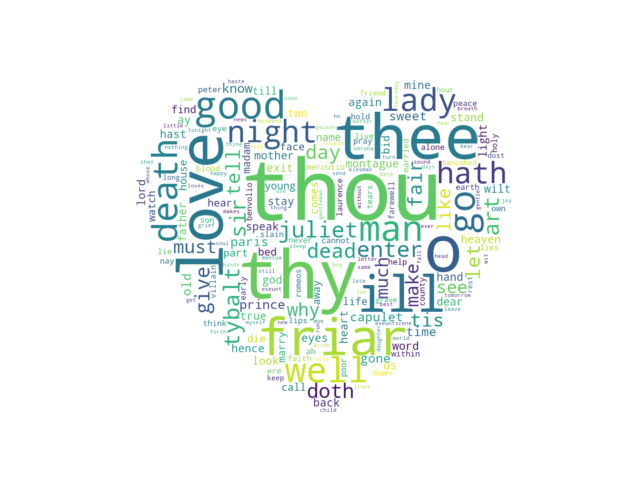

#WordCloud
Summary: Python code that generates a word cloud from a text file where the size of the word is proportional to its frequency found in the text.
The Word Cloud can be generated from the command line. Please make sure that your first argument is your text file and the second one your mask.
Here is an example in PowerShell: 
python ./wordcloud_example.py ./RomeoandJuliet.txt ./heart.jpeg

The image below was generated through calculating the frequencies of words found in Plutarch's 'Life of Solon'. 
I used an image of the parthenon as the mask. You are welcome to use your own text and mask.

This image is taken with a different heart shaped mask and the text is taken from Shakespeare's Romeo and Juliet.

